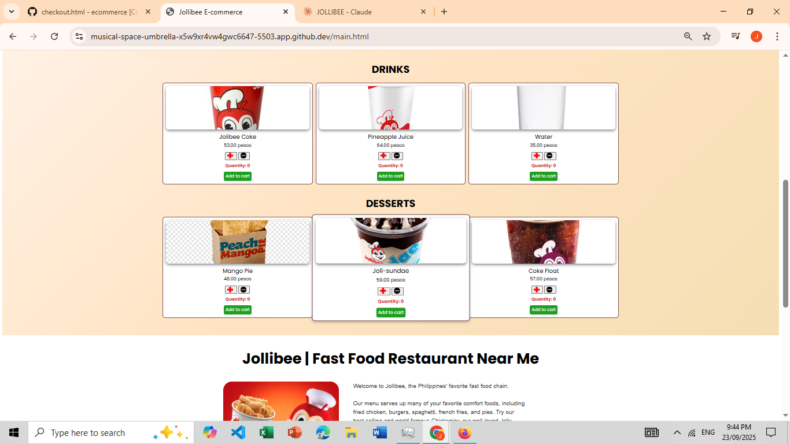
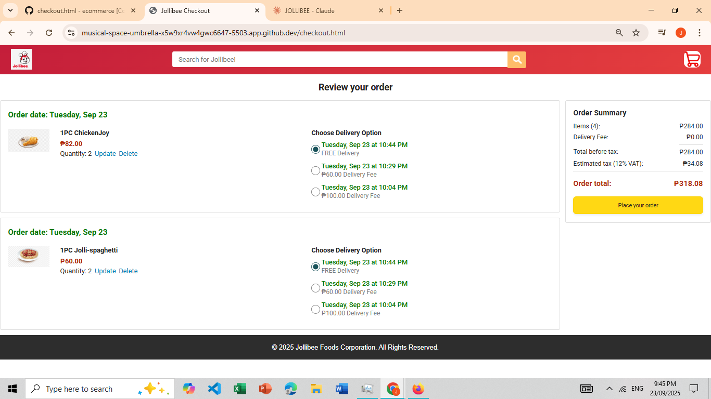

# 🍔 E-Commerce (Jollibee-Inspired Theme)

## 📌 Overview

Hello everyone!  
This project is an **E-Commerce Website inspired by Jollibee**, showcasing my progress in **Front-end Web Development** using **HTML, CSS, and JavaScript**.

In the future, I plan to extend this project with **Back-end technologies** such as **PHP or Node.js** and integrate a **Database** (MySQL or MongoDB).

The main purpose of this project is to **showcase my learning journey** in web development, especially focusing on **JavaScript** and gradually applying more stacks along the way.

---

## ✨ Features

- 🍟 Responsive **Homepage with Banner**
- 🍔 **Menu Section** displaying items
- 📖 **Description Section**
- 📞 **Contact Page**
- 🛒 **Order Webpage**

---

## 📸 Snapshots

### Banner Part


### Menu Part



### Description Part


### Contact Part


### Order Webpage



---

## ⚙️ Installation

Clone the repository and run locally:

```bash
# Clone the repository
git clone https://github.com/kuroi17/ecommerce

# Navigate into the project folder
cd ecommerce

# Open the main file (static HTML project)
open main.html   # (Mac)
start main.html  # (Windows)
```

## 🛠️ Tech Stack

**Front-end:**

- HTML5
- CSS3
- VanillaJS

**Planned Back-end (Future):**

- PHP or Node.js
- MySQL or MongoDB

## 📬 Contact

Feel free to reach out if you’d like to **collaborate, share ideas, or give feedback!**

- 📩 Email: painkira518@gmail.com
- 💼 LinkedIn: [Jyvhan Earl Ponce](https://www.linkedin.com/in/jyvhan-earl-ponce-31778a306/)
- 🐙 GitHub: [kuroi17](https://github.com/kuroi17)
